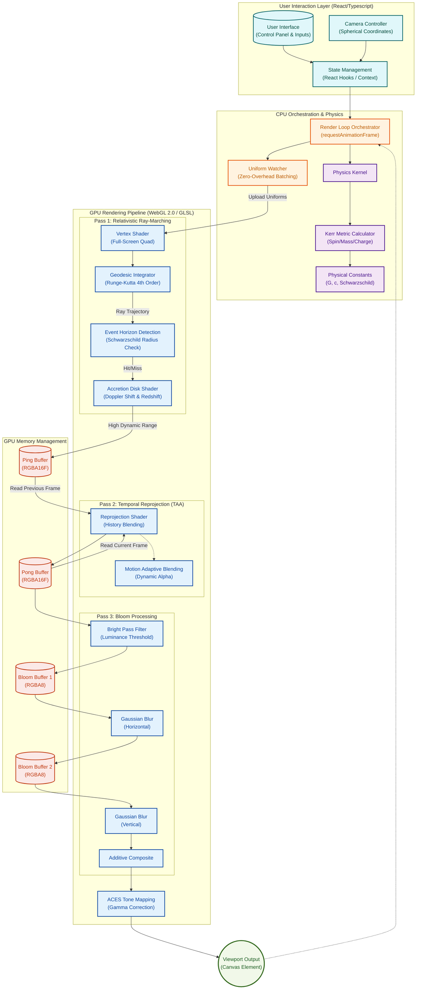
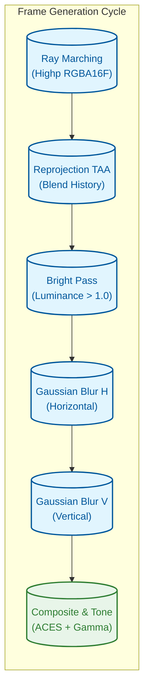
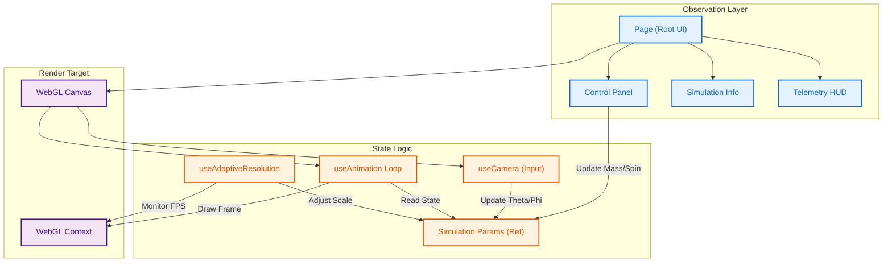

# System Architecture & Engineering Specifications

This document outlines the high-performance rendering pipeline, mathematical foundations, and software architecture of the relativistic black hole simulation.

---

## 1. End-to-End Execution Pipeline

The rendering engine operates on a reactive data pipeline, transforming user inputs into relativity-corrected visual output via a multi-stage WebGL 2.0 rendering pass.



---

## 2. Project File Structure Analysis

The project is organized into strictly defined modules to separate concerns between the React application lifecycle, the CPU-side physics engine, and the GPU-side shader programs.

```text
src/
├── app/                                  # Next.js App Router (Entry Points)
│   ├── globals.css                       # Global Tailwind resets & font faces
│   ├── layout.tsx                        # Root layout & SEO Metadata injection
│   ├── page.tsx                          # Main simulation view controller
│   ├── robots.ts                         # Search engine indexing directives
│   └── sitemap.ts                        # XML Sitemap generator
│
├── components/                           # UI & Rendering Components
│   ├── canvas/
│   │   └── WebGLCanvas.tsx               # Manages WebGL context lifecycle
│   └── ui/
│       ├── ControlPanel.tsx              # User inputs (mass, spin, resolution)
│       ├── DebugOverlay.tsx              # Developer metrics (buffers, TAA)
│       ├── SimulationInfo.tsx            # Semantic overlay for physics education
│       ├── Telemetry.tsx                 # Real-time FPS & resolution HUD
│       └── UserProfile.tsx               # Session identity display
│
├── configs/                              # Static Configuration
│   ├── features.ts                       # Feature flags (RayTracing, Bloom)
│   ├── performance.config.ts             # Hardware tier thresholds
│   ├── physics.config.ts                 # Simulation constants (G, c)
│   └── simulation.config.ts              # Default camera & quality settings
│
├── hooks/                                # Logic & State Management
│   ├── useAdaptiveResolution.ts          # Dynamic DPI scaling logic
│   ├── useAnimation.ts                   # Main Render Loop (requestAnimationFrame)
│   ├── useCamera.ts                      # Spherical coordinate physics & inputs
│   ├── useMobileOptimization.ts          # Device tier detection logic
│   ├── usePresets.ts                     # Graphics quality profiles (Low/Ultra)
│   └── useWebGL.ts                       # Low-level GL context initialization
│
├── performance/                          # Telemetry & Optimization
│   ├── benchmark.ts                      # Automated hardware capability testing
│   └── monitor.ts                        # Frame time & memory tracking
│
├── physics/                              # Core Mathematics
│   ├── constants.ts                      # Geometric unit definitions
│   └── kerr-metric.ts                    # Tensor calculations for space-time
│
├── rendering/                            # WebGL Pass Orchestration
│   ├── adaptive-resolution.ts            # Scaling strategy implementation
│   ├── bloom.ts                          # Dual-pass Gaussian blur engine
│   └── reprojection.ts                   # Temporal Anti-Aliasing manager
│
├── shaders/                              # GLSL Programs
│   ├── blackhole/
│   │   └── fragment.glsl                 # Core Ray-Marching Kernel
│   ├── postprocess/
│   │   ├── bloom.glsl                    # Bright Pass & Blur shaders
│   │   └── reprojection.glsl             # Velocity-based history blending
│   └── manager.ts                        # Program linker & validator
│
├── storage/                              # Persistence
│   └── settings.ts                       # LocalStorage wrapper for user prefs
│
├── types/                                # TypeScript Interfaces
│   ├── features.ts                       # Feature flag definitions
│   └── simulation.ts                     # Core state shapes (Params, Camera)
│
└── utils/                                # Helpers
    ├── cpu-optimizations.ts              # Uniform batching & dirty-checking
    ├── device-detection.ts               # GPU model identification
    ├── geometry.ts                       # Vertex buffer geometric primitives
    ├── validation.ts                     # Input sanitization
    └── webgl-utils.ts                    # GL function wrappers
```

---

## 3. Mathematical Framework & Physics

The simulation leverages General Relativity to visualize spacetime curvature. All calculations use **Geometric Units** ($G = c = 1$) to avoid floating-point underflow.

### 3.1. The Kerr Metric (Rotating Black Hole)

The spacetime geometry is defined by the Kerr Metric in Boyer-Lindquist coordinates:

$$
ds^2 = -\left(1 - \frac{2Mr}{\Sigma}\right) dt^2 - \frac{4Mar \sin^2\theta}{\Sigma} dt d\phi + \frac{\Sigma}{\Delta} dr^2 + \Sigma d\theta^2 + \left(r^2 + a^2 + \frac{2Ma^2r \sin^2\theta}{\Sigma}\right) \sin^2\theta d\phi^2
$$

Where:

- $\Sigma = r^2 + a^2 \cos^2\theta$
- $\Delta = r^2 - 2Mr + a^2$
- $a = J/M$ (Spin parameter)

### 3.2. Geodesic Integration (Ray Marching)

Light rays are traced by solving the **Null Geodesic Equation**:

$$
\frac{d^2x^\mu}{d\lambda^2} + \Gamma^\mu_{\alpha\beta} \frac{dx^\alpha}{d\lambda} \frac{dx^\beta}{d\lambda} = 0
$$

To optimize performance, we approximate this using an RK4 stepper with an adaptive step size $\Delta t$:

$$
\Delta t = \max(\Delta t_{\min}, k \cdot (r - r_s))
$$

This allocates more computational power near the event horizon where curvature is extreme.

---

## 4. Shader Pipeline Breakdown

The visual output is generated via a multi-pass pipeline to ensure high fidelity and temporal stability.



### 4.1 Detailed Pass Configurations

| Pass  | Shader                          | Resolution  | Format      | Purpose                                                                                                                                                                                                                      |
| :---- | :------------------------------ | :---------- | :---------- | :--------------------------------------------------------------------------------------------------------------------------------------------------------------------------------------------------------------------------- |
| **1** | `blackhole/fragment.glsl`       | Full Screen | **RGBA16F** | Ray-marches the scene. Calculates event horizon intersections, accretion disk emission (blackbody), and gravitational lensing.                                                                                               |
| **2** | `postprocess/reprojection.glsl` | Full Screen | **RGBA16F** | **Temporal Anti-Aliasing (TAA)**. Blends current frame with previous frame (`HistoryBuffer`) to reduce noise. Alpha ($\alpha$) adapts to motion: • Static: $\alpha=0.9$ (High Quality) • Moving: $\alpha=0.5$ (Low Ghosting) |
| **3** | `postprocess/bloom.glsl`        | 1/2 Screen  | **RGBA8**   | **Bright Pass**. Extracts pixels with Luminance $> 1.0$ (High Dynamic Range glow).                                                                                                                                           |
| **4** | `postprocess/bloom.glsl`        | 1/4 Screen  | **RGBA8**   | **Gaussian Blur H**. Blurs the bright pass horizontally.                                                                                                                                                                     |
| **5** | `postprocess/bloom.glsl`        | 1/4 Screen  | **RGBA8**   | **Gaussian Blur V**. Blurs the result vertically to complete the glow effect.                                                                                                                                                |
| **6** | `compositing`                   | Full Screen | **RGBA8**   | **Final Compose**. Adds Bloom to Scene, applies ACES Tone Mapping, and performs Gamma Correction ($2.2$).                                                                                                                    |

---

## 5. Performance Complexity Standards

This project adheres to strict **Time** and **Space** complexity constraints to ensure performance on consumer hardware.

### 5.1 Time Complexity Targets

- **CPU Render Loop**: $O(1)$ relative to simulation time.
  - No per-frame allocations inside `requestAnimationFrame`.
  - All uniform updates use cached `Float32Array` views or dirty-checking.
- **GPU Ray Marching**: $O(N)$ where $N$ is steps.
  - Optimized via **Adaptive Stepping** near mass concentrations.
  - Target: < 16ms per frame.

### 5.2. Memory Safety & Space Complexity

- **Space Complexity**: $O(1)$ (Constant) relative to time.
  - All heavy assets (Textures, Buffers) are allocated **once** at startup or resize.
  - No dynamic object creation in the simulation loop.
- **Leak Prevention**:
  - `gl.deleteTexture`, `gl.deleteFramebuffer`, and `gl.deleteProgram` are explicitly called in cleanup hooks.
  - "Zero-Copy" architecture where possible (using Typed Arrays).

---

## 6. Component & State Architecture

The user interface and simulation state are decoupled from the render loop via React refs and efficient context management.



---

## 7. Adaptive Performance Loop

The system implements a closed-loop control system to maintain framerate stability by dynamically adjusting render quality.

```mermaid
graph LR
    classDef monitor fill:#ffebee,stroke:#c62828,stroke-width:2px,color:#c62828
    classDef decision fill:#e8f5e9,stroke:#2e7d32,stroke-width:2px,color:#2e7d32
    classDef action fill:#fffde7,stroke:#fbc02d,stroke-width:2px,color:#fbc02d

    Measure[("Monitor Frame Time<br/>(ms)")]:::monitor
    History{("History Buffer<br/>(Avg 60 Frames)")]:::monitor
    Threshold{("Check Thresholds<br/>(<16ms vs >33ms)")]:::decision

    ScaleDown["Downgrade Resolution<br/>(Current - 0.1)"]:::action
    ScaleUp["subgraph Upgrade"]:::action
    PresetDrop["Fallback to Lower Preset<br/>(High -> Medium)"]:::action

    Measure --> History
    History --> Threshold

    Threshold -- "Stable (<14ms)" --> ScaleUp["Upgrade Resolution<br/>(Current + 0.05)"]
    Threshold -- "Struggling (>18ms)" --> ScaleDown
    Threshold -- "Critical (>33ms)" --> PresetDrop

    ScaleUp --> Measure
    ScaleDown --> Measure
    PresetDrop --> Measure
```

### 7.1. Logic Rules

1. **Warmup Phase**: The first 120 frames are ignored to allow JIT compilation and texture upload.
2. **Hysteresis**: Resolution upgrade requires 60 consecutive "good" frames to prevent oscillation (flickering).
3. **Critical Drop**: If instantaneous FPS drops below 20, the preset is immediately downgraded (e.g., _Ultra_ → _High_).
