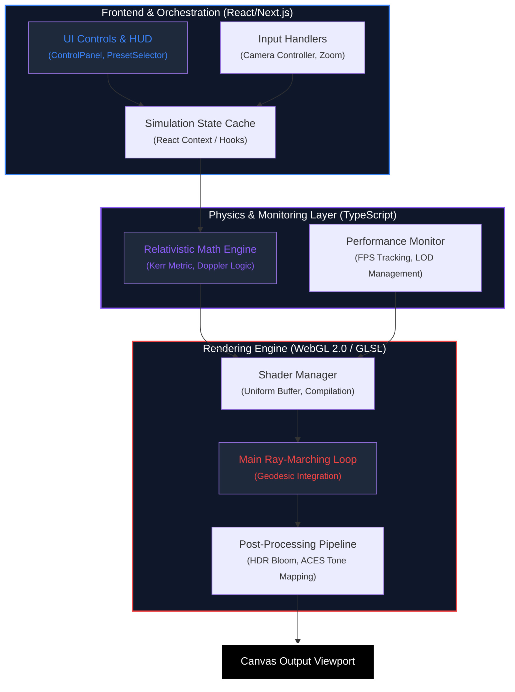

# Black Hole Simulation Architecture

System architecture and engineering specifications for the relativistic ray-marching engine.

---

## 1. System Architecture Diagram

The simulation follows a reactive data pipeline where physical parameters flow from the UI state through mathematical transformers into the GPU-side ray-marching engine.



---

## 2. Optimized Project Structure

The project is organized into functional layers to separate physical modeling, GPU execution, and UI management.

```text
src/
├── app/                  # Next.js App Router (Layouts & Pages)
├── components/           # UI & Rendering Components
│   ├── canvas/           # WebGL Entry points (Canvas, Context initialization)
│   └── ui/               # HUD, Controls, and Settings Panels
├── hooks/                # Reactive Logic (Camera, Animation, Presets)
├── physics/              # Mathematical Foundations (Metric, Doppler, Relativistic)
├── shaders/              # GLSL Implementations
│   ├── blackhole/        # Surface & Volumetric Shaders
│   ├── postprocess/      # Bloom, Blur, and Tone Mapping Kernels
│   └── manager.ts        # Shader Compilation & Uniform Handling
├── rendering/            # Pipeline Orchestration (Adaptive Resolution, Pass Management)
├── performance/          # System Reliability (Monitoring, Validation, Benchmarks)
├── storage/              # Persistence Layer (Settings, History)
├── types/                # Global Type Definitions
└── utils/                # General Utilities (Memory, Debugging, WebGL Helpers)
```

---

## 3. Data Flow & Execution Pipeline

### 3.1 Orchestration

Integrated via **Next.js**, managing the lifecycle of the WebGL context. Parameter changes trigger uniform updates without re-compiling shaders, ensuring zero-latency interaction.

### 3.2 Physics Integration

Physical constants and metric calculations are performed in `src/physics/`. These results are passed as uniforms to the GPU, where the **Geodesic Integrator** solves the null geodesic equations using an optimized $r^{-4}$ pseudo-potential for real-time visualization.

### 3.3 Post-Processing

The rendering pipeline uses a multi-pass approach:

1. **Geometry Pass**: Ray-march the black hole and accretion disk.
2. **Bloom Pass**: Extract high-luminance areas and apply Gaussian blur.
3. **Resolve Pass**: Composite layers with ACES Filmic Tone Mapping and Gamma correction.

---

## 4. Performance Models (LOD)

The system dynamically adjusts complexity based on hardware capability:

| Tier       | Model     | Strategy                                      | Target Hardware          |
| :--------- | :-------- | :-------------------------------------------- | :----------------------- |
| **High**   | Full Kerr | Full geodesic ray-marching (200 steps).       | Dedicated RTX/GTX GPUs   |
| **Medium** | Geometric | Optimized steps (100) + simplified noise.     | Integrated GPUs / M1 Mac |
| **Low**    | Analytic  | 2D Lensing approximation + zero ray-marching. | Mobile Devices           |

---

## 5. Engineering Constraints

- **TDR Prevention**: Loop iterations are hard-capped to avoid driver timeouts on integrated chipsets.
- **Memory Footprint**: All procedural assets (stars, noise) are generated on-the-fly to maintain a <2MB bundle size.
- **Precision**: Physics-critical variables use `highp` precision; visual-only data uses `mediump` for optimization.

---

## 6. Confidentiality & Intellectual Property

This project is licensed as **Proprietary and Confidential**. The confidentiality protects the following core intellectual assets:

### 6.1 Trade Secret Algorithms

- **Interleaved Performance-FBM**: A manual shader-unroll optimization that achieves volumetric turbulence appearance at a fraction of the standard noise cost.
- **Pseudo-Potential Ray-Marching**: A unique adaptation of General Relativity equations using a scientifically tuned $r^{-4}$ correction model. It enables accurate visualization of the photon sphere at $3M$ and stable light orbits while maintaining high performance on consumer-grade GPUs.

### 6.2 Competitive Edge

The project's primary value lies in its high-fidelity performance on consumer-grade and integrated GPUs, achieved through these non-public mathematical heuristics.
