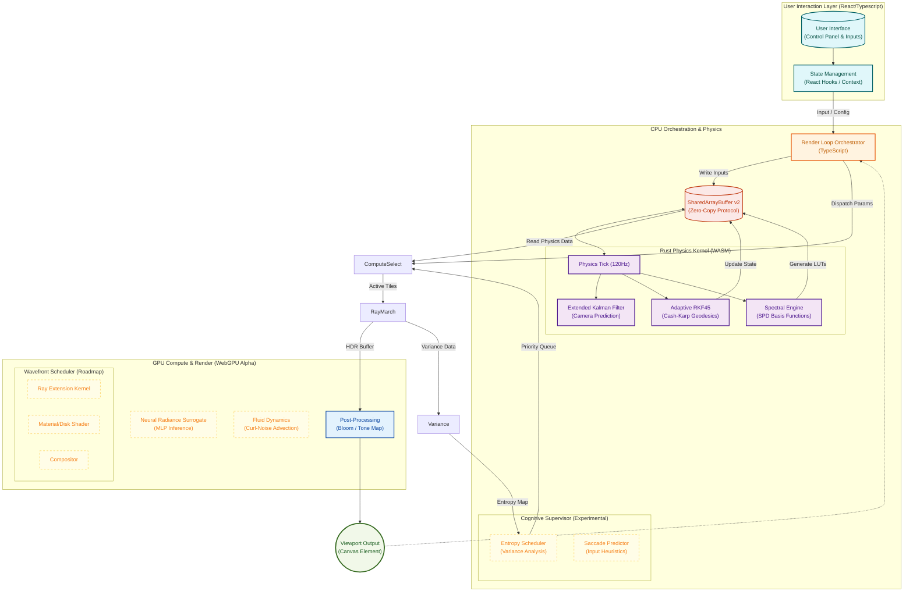

# System Architecture & Engineering Specifications

This document outlines the high-performance rendering pipeline, mathematical foundations, and software architecture of the relativistic black hole simulation. It reflects the **Hybrid Rust/WebGL 2.0 Architecture** (with WebGPU support in Alpha) and the project's long-term roadmap for predictive rendering.

---

## 1. Execution Pipeline

The rendering engine operates on a **Zero-Copy Reactive Data Pipeline**, utilizing a strict separation of concerns between the high-level orchestration (TypeScript), the physics kernel (Rust/WASM), the massively parallel rendering engine (WebGPU), and the intelligent supervisor (Cognitive Layer).



---

## 2. Project File Structure Analysis

The project is organized into strictly defined modules to separate concerns between the React application lifecycle, the CPU-side physics engine (Rust), and the GPU-side shader programs (WebGPU).

```text
src/
├── app/                                  # Next.js App Router (Entry Points)
│   ├── globals.css                       # Global Tailwind resets & font faces
│   ├── layout.tsx                        # Root layout & SEO Metadata injection
│   ├── page.tsx                          # Main simulation view controller
│   └── ...
│
├── components/                           # UI & Rendering Components
│   ├── canvas/
│   │   └── WebGLCanvas.tsx               # Manages WebGL/WebGPU context
│   └── ui/                               # HUD, Control Panel, Telemetry
│
├── configs/                              # Static Configuration
│   ├── features.ts                       # Feature flags
│   ├── physics.config.ts                 # Simulation constants
│   └── ...
│
├── hooks/                                # Logic & State Management
│   ├── useAnimation.ts                   # Main Render Loop
│   ├── usePhysicsEngine.ts               # Rust/WASM Bridge & SAB Management
│   └── ...
│
├── physics-engine/                       # Rust Physics Kernel
│   ├── Cargo.toml                        # Dependencies (wasm-bindgen, glam)
│   └── src/
│       ├── lib.rs                        # WASM Interface & SAB Protocol
│       ├── kerr.rs                       # Kerr Metric Solvers (f64)
│       ├── integrator.rs                 # Adaptive RKF45 Stepper
│       ├── geodesic.rs                   # Relativistic Geodesic Core
│       ├── derivatives.rs                # Hamiltonian Equations of Motion
│       ├── invariants.rs                 # Numerical Regularization
│       ├── spectrum.rs                   # Spectral Rendering (Gauss-Laguerre)
│       ├── camera.rs                     # EKF Camera Physics
│       └── constants.rs                  # Physical Constants

│
├── rendering/                            # Rendering Orchestration
│   ├── webgpu-renderer.ts                # WebGPU Device & Pass Management
│   └── ...
│
├── shaders/                              # WGSL & GLSL Programs
│   ├── raymarching.wgsl                  # Core Compute Shader
│   ├── postprocess/                      # Bloom, Tone Mapping
│   └── ...
│
├── types/                                # TypeScript Interfaces
│   ├── physics-engine.d.ts               # WASM Module Types
│   └── ...
│
└── utils/                                # Helpers
    ├── errorTracking.ts                  # Global Error Handling
    └── ...
```

---

## 3. Architecture Logic Levels

The system employs a multi-tiered architecture to balance precision, performance, and flexibility.

### 3.1. Level 1: Orchestration (TypeScript)

**Responsibility**: Input handling, UI state, and the main Event Loop.

- **Role**: Conductor. It does not perform heavy math.
- **Data**: Reads user input, writes to the **SharedArrayBuffer (SAB)**, and dispatches GPU commands.

### 3.2. Level 2: Physics Kernel (Rust/WASM)

**Responsibility**: High-precision relativistic calculations and state stability.

- **Role**: The Brain. Runs at a fixed high-frequency tick (e.g., 120Hz).
- **Core Modules**:
  - **`kerr`**: Solves exact horizons and ISCO using `f64`.
  - **`geodesic` / `integrator`**: Integrates ray paths using an **Adaptive RKF45** method.
  - **`spectrum`**: Generates LUTs for Doppler-shifted blackbody radiation.

  - **`camera`**: Uses an **Extended Kalman Filter (EKF)** to predict camera movement and eliminate latency.

### 3.3. Level 3: Compute & Render (WebGPU)

**Responsibility**: Massively parallel ray tracing and pixel processing.

- **Role**: The Muscle. Executes billions of ray steps per second.
- **Key Tech**:
  - **Compute Shaders**: <span style="color:red">**[NOT IMPLEMENTED]**</span> - (WebGL 2.0 Fragment Shaders currently used for primary tracing).
  - **Tiled Rendering**: <span style="color:red">**[NOT IMPLEMENTED]**</span> - (Global quad dispatch currently used).
  - **Variable Rate Shading (VRS)**: <span style="color:red">**[NOT IMPLEMENTED]**</span>.

### 3.4. Level 4: Cognitive Supervisor (Heuristics)

**Responsibility**: Intelligent workload allocation and prediction.

- **Role**: The Tactician. Optimizes _where_ and _when_ to render.
- **Modules**:
  - **Entropy Scheduler**: <span style="color:red">**[NOT IMPLEMENTED]**</span>. Analyzes frame variance to direct compute shaders to "interesting" regions.
  - **Saccade Predictor**: <span style="color:red">**[NOT IMPLEMENTED]**</span>. Detects rapid eye/camera movements and temporarily reduces resolution.

---

## 4. Zero-Copy Communication Protocol (SAB v2)

To eliminate Garbage Collection (GC) pauses, the system uses a rigid binary protocol over a `SharedArrayBuffer` shared between JS, Rust, and (via mapping) the GPU.

| Offset  | Section       | Size     | Content                                                |
| :------ | :------------ | :------- | :----------------------------------------------------- |
| `0x000` | **Control**   | 64B      | Mutex locks, Frame Counters, Ready Flags (Atomics).    |
| `0x040` | **Camera**    | 64B      | Position, Quaternion, Velocity Vectors (EKF State).    |
| `0x080` | **Physics**   | 128B     | Mass, Spin, $r_{horizon}$, $r_{isco}$, $T_{disk}$.     |
| `0x100` | **Telemetry** | 256B     | FPS, Frame Time, GPU Disjoint Timer values.            |
| `0x800` | **LUTs**      | Variable | Spectral Intensity Tables, Accretion Density Profiles. |

---

## 5. Mathematical Framework (Advanced)

### 5.1. Symplectic Integration

Geometric optics are validated using an **Adaptive Runge-Kutta-Fehlberg 4(5)** integrator, which conserves the Hamiltonian energy $H = \frac{1}{2} g^{\mu\nu} p_\mu p_\nu = 0$ by adjusting step sizes to maintain local error bounds, preventing orbital decay near the horizon.

### 5.2. Radiative Transfer

Unlike simple ray-tracing, the engine solves the **Radiative Transfer Equation (RTE)** along the ray path:
$$ \frac{dI*\nu}{d\lambda} = -\alpha*\nu I*\nu + j*\nu $$
This allows for volumetric effects like self-shadowing and realistic limb darkening of the accretion disk.

### 5.3. Spectral Rendering

We transition from RGB colors to **Spectral Radiance**. Light is modeled as a temperature $T$. The observed color is computed by integrating the Planck distribution, shifted by the relativistic Dopper/Gravitational factor $g$, against CIE Color Matching Functions.

---

## 6. Performance Logic

### 6.1. Tiled Compute Rendering

The screen is divided into 8x8 tiles. A coarse pass determines if a tile intersects the Black Hole's influence. Complex compute shaders are dispatched _only_ for active tiles, saving 80% of GPU cycles on empty starfields.

### 6.2. Predictive Latency Compensation

The Rust kernel uses an **Extended Kalman Filter (EKF)** to predict the camera's position at the exact moment of V-Sync ($t + 16.6ms$), virtually eliminating the "rubber-banding" feel of heavy simulations.

---
